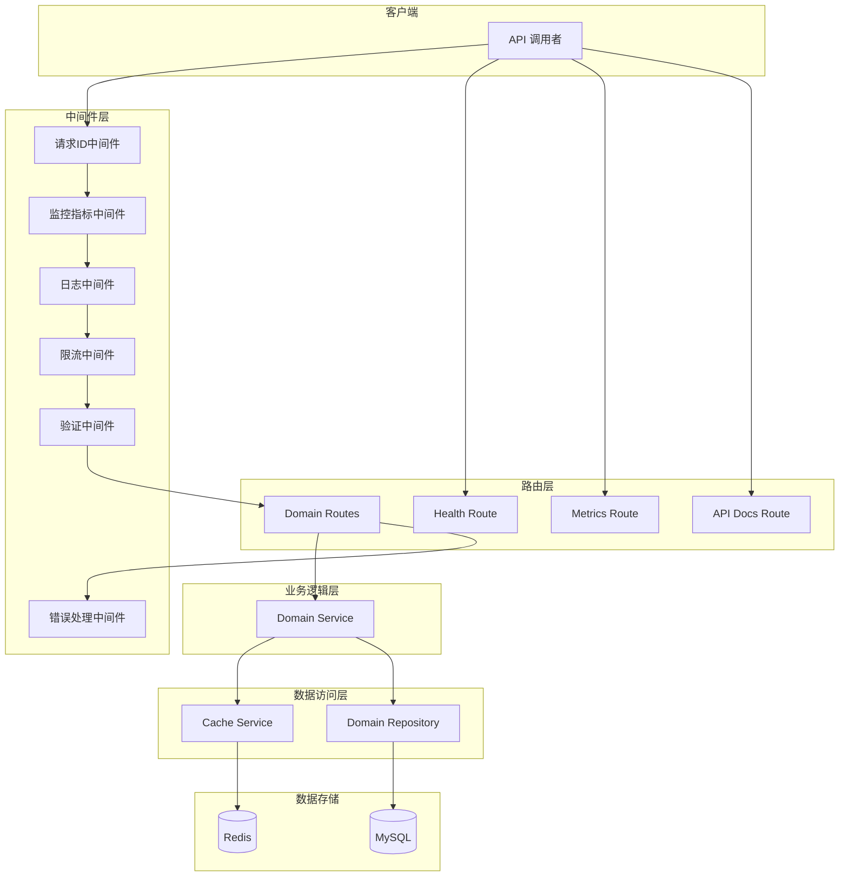
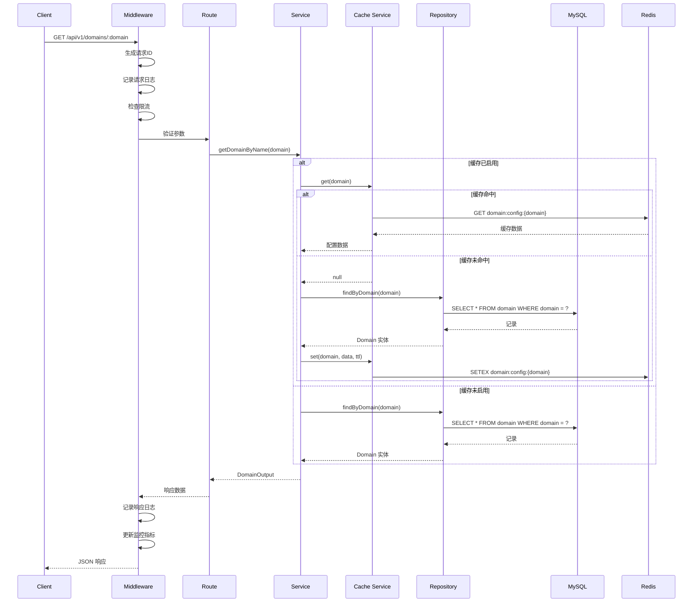
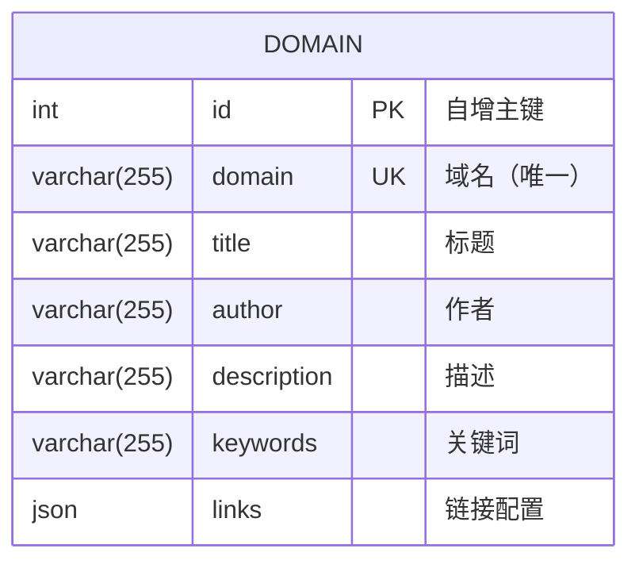
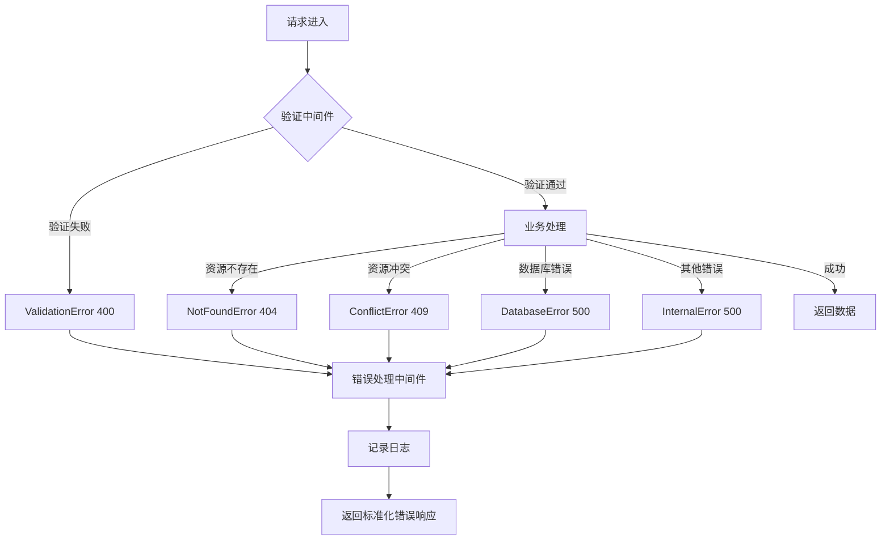

# 设计文档

## 概述

域名配置服务是一个基于 Node.js + TypeScript 的后端服务，采用三层架构模式（Routes → Services → Repositories）实现域名配置的管理和查询功能。服务使用 Express 作为 Web 框架，Sequelize 作为 ORM，支持可选的 Redis 缓存层以提高查询性能。

### 核心设计原则

1. **分层架构**: 清晰的职责分离，便于测试和维护
2. **依赖注入**: 支持 Mock 测试，提高代码可测试性
3. **缓存透明**: 缓存层对业务逻辑透明，可通过配置启用/禁用
4. **统一错误处理**: 标准化的错误响应格式
5. **可观测性**: 完善的日志、监控和健康检查

## 架构

### 系统架构图



### 请求处理流程



## 组件和接口

### 1. 配置模块 (src/config/)

#### env.ts - 环境变量配置

```typescript
interface EnvConfig {
  // 服务配置
  nodeEnv: string;
  port: number;
  
  // 数据库配置
  dbHost: string;
  dbPort: number;
  dbName: string;
  dbUser: string;
  dbPassword: string;
  dbPoolMin: number;
  dbPoolMax: number;
  
  // Redis 配置
  redisEnabled: boolean;
  redisHost: string;
  redisPort: number;
  redisPassword: string;
  redisTtl: number;  // 缓存过期时间（秒）
  
  // 日志配置
  logLevel: string;
  logFile: string;
  
  // API 配置
  apiPrefix: string;
  maxPageSize: number;
  defaultPageSize: number;
  
  // 限流配置
  rateLimitWindowMs: number;
  rateLimitMax: number;
}
```

#### database.ts - 数据库连接

```typescript
interface DatabaseModule {
  sequelize: Sequelize;
  connectWithRetry(maxRetries?: number, delay?: number): Promise<void>;
}
```

#### redis.ts - Redis 连接

```typescript
interface RedisModule {
  redis: Redis | null;
  isRedisEnabled(): boolean;
  connectRedis(): Promise<void>;
  closeRedis(): Promise<void>;
}
```

### 2. 中间件模块 (src/middleware/)

#### RequestIdMiddleware.ts

```typescript
function requestIdMiddleware(req: Request, res: Response, next: NextFunction): void;
```

#### ValidationMiddleware.ts

```typescript
function validateRequest(schema: Joi.Schema, type: 'body' | 'query' | 'params'): RequestHandler;
function validateBody(schema: Joi.Schema): RequestHandler;
function validateQuery(schema: Joi.Schema): RequestHandler;
function validateParams(schema: Joi.Schema): RequestHandler;
```

#### ErrorMiddleware.ts

```typescript
class ValidationError extends Error {
  constructor(message: string, code?: string, details?: Record<string, unknown>);
}

class NotFoundError extends Error {
  constructor(message: string, code?: string);
}

class ConflictError extends Error {
  constructor(message: string, code?: string);
}

class DatabaseError extends Error {
  constructor(message: string, code?: string, originalError?: Error);
}

function errorHandler(err: Error, req: Request, res: Response, next: NextFunction): void;
function asyncHandler(fn: AsyncRequestHandler): RequestHandler;
```

### 3. 数据模型 (src/models/)

#### Domain.ts

```typescript
interface DomainAttributes {
  id: number;
  domain: string;
  title: string | null;
  author: string | null;
  description: string | null;
  keywords: string | null;
  links: object | null;
}

interface DomainCreationAttributes extends Optional<DomainAttributes, 'id'> {}

class Domain extends Model<DomainAttributes, DomainCreationAttributes> 
  implements DomainAttributes {
  declare id: number;
  declare domain: string;
  declare title: string | null;
  declare author: string | null;
  declare description: string | null;
  declare keywords: string | null;
  declare links: object | null;
}
```

### 4. 数据访问层 (src/repositories/)

#### DomainRepository.ts

```typescript
interface DomainRepository {
  create(data: DomainCreationAttributes): Promise<Domain>;
  findById(id: number): Promise<Domain | null>;
  findByDomain(domain: string): Promise<Domain | null>;
  findAll(pagination: Pagination): Promise<Domain[]>;
  count(): Promise<number>;
  update(id: number, data: Partial<DomainAttributes>): Promise<Domain | null>;
  delete(id: number): Promise<boolean>;
}
```

### 5. 缓存服务 (src/services/)

#### CacheService.ts

```typescript
interface CacheService {
  get<T>(key: string): Promise<T | null>;
  set<T>(key: string, value: T, ttl?: number): Promise<void>;
  delete(key: string): Promise<void>;
  isEnabled(): boolean;
}

// 缓存键格式
const CACHE_KEY_PREFIX = 'domain:config:';
```

### 6. 业务逻辑层 (src/services/)

#### DomainService.ts

```typescript
interface DomainInput {
  domain: string;
  title?: string;
  author?: string;
  description?: string;
  keywords?: string;
  links?: object;
}

interface DomainOutput {
  id: number;
  domain: string;
  title: string | null;
  author: string | null;
  description: string | null;
  keywords: string | null;
  links: object | null;
}

interface PaginatedResult<T> {
  data: T[];
  pagination: {
    page: number;
    pageSize: number;
    total: number;
    totalPages: number;
  };
}

interface DomainService {
  create(input: DomainInput): Promise<DomainOutput>;
  getById(id: number): Promise<DomainOutput | null>;
  getByDomain(domain: string): Promise<DomainOutput | null>;
  list(pagination: Pagination): Promise<PaginatedResult<DomainOutput>>;
  update(id: number, input: Partial<DomainInput>): Promise<DomainOutput | null>;
  delete(id: number): Promise<boolean>;
}
```

### 7. 路由层 (src/routes/)

#### DomainRoutes.ts

```typescript
// API 端点定义
// GET    /api/v1/domains           - 获取域名配置列表（分页）
// GET    /api/v1/domains/:domain   - 通过域名获取配置
// GET    /api/v1/domains/:id    - 通过 ID 获取配置
// POST   /api/v1/domains           - 创建域名配置
// PUT    /api/v1/domains/:id       - 更新域名配置
// DELETE /api/v1/domains/:id       - 删除域名配置
```

### 8. 验证模式 (src/validation/)

#### schemas.ts

```typescript
// 域名参数验证
const domainParamSchema = Joi.object({
  domain: Joi.string()
    .min(1)
    .max(255)
    .required()
    .messages({
      'string.min': '域名不能为空',
      'string.max': '域名长度不能超过255字符',
    }),
});

// 创建域名配置验证
const createDomainSchema = Joi.object({
  domain: Joi.string().min(1).max(255).required(),
  title: Joi.string().max(255).allow(null, ''),
  author: Joi.string().max(255).allow(null, ''),
  description: Joi.string().max(255).allow(null, ''),
  keywords: Joi.string().max(255).allow(null, ''),
  links: Joi.object().allow(null),
});

// 更新域名配置验证
const updateDomainSchema = Joi.object({
  title: Joi.string().max(255).allow(null, ''),
  author: Joi.string().max(255).allow(null, ''),
  description: Joi.string().max(255).allow(null, ''),
  keywords: Joi.string().max(255).allow(null, ''),
  links: Joi.object().allow(null),
});

// 分页验证
const paginationSchema = Joi.object({
  page: Joi.number().integer().min(1).default(1),
  pageSize: Joi.number().integer().min(1).max(100).default(20),
});
```

## 数据模型

### Domain 实体



### 数据库表结构

```sql
CREATE TABLE `domain` (
  `id` int NOT NULL AUTO_INCREMENT,
  `domain` varchar(255) NOT NULL UNIQUE,
  `title` varchar(255) DEFAULT NULL,
  `author` varchar(255) DEFAULT NULL,
  `description` varchar(255) DEFAULT NULL,
  `keywords` varchar(255) DEFAULT NULL,
  `links` json DEFAULT NULL,
  PRIMARY KEY (`id`),
  UNIQUE KEY `domain` (`domain`)
) ENGINE=InnoDB DEFAULT CHARSET=utf8mb3 COLLATE=utf8mb3_unicode_ci;
```

### API 响应格式

#### 成功响应

```typescript
// 单个资源
interface SuccessResponse<T> {
  data: T;
}

// 分页列表
interface PaginatedResponse<T> {
  data: T[];
  pagination: {
    page: number;
    pageSize: number;
    total: number;
    totalPages: number;
  };
}
```

#### 错误响应

```typescript
interface ErrorResponse {
  error: {
    code: string;
    message: string;
    details?: {
      errors?: Array<{
        field: string;
        message: string;
        type: string;
      }>;
    };
  };
}
```

### 缓存数据结构

```typescript
// Redis 键格式: domain:config:{domain}
// 值: JSON 序列化的 DomainOutput
// TTL: 配置的 REDIS_TTL 秒（默认 3600）
```


## 正确性属性

*正确性属性是一种应该在系统所有有效执行中保持为真的特征或行为——本质上是关于系统应该做什么的形式化陈述。属性作为人类可读规范和机器可验证正确性保证之间的桥梁。*

### Property 1: 域名查询往返一致性

*对于任意*有效的域名配置数据，创建该配置后通过域名查询，返回的数据应与创建时的输入数据一致（id 除外）。

**验证: 需求 1.1, 3.1**

### Property 2: 不存在资源返回 404

*对于任意*不存在于数据库中的域名或 ID，查询、更新或删除操作应返回 404 状态码和标准化错误响应。

**验证: 需求 1.2, 3.4, 3.6**

### Property 3: 无效输入返回 400

*对于任意*无效的输入数据（空域名、超长字段、无效 JSON），创建或更新操作应返回 400 状态码和包含具体字段错误信息的响应。

**验证: 需求 1.3, 4.1, 4.2, 4.3**

### Property 4: 请求 ID 存在且唯一

*对于任意*请求，响应头中应包含 X-Request-ID，且多个请求的 ID 应互不相同。

**验证: 需求 1.4, 7.2**

### Property 5: 缓存行为正确性

*对于任意*域名配置，当缓存启用时：
- 首次查询应从数据库获取并存入缓存
- 后续查询应从缓存获取
- 更新或删除后缓存应失效

**验证: 需求 2.1, 2.2, 2.3, 2.4, 2.5**

### Property 6: 重复域名返回 409

*对于任意*已存在的域名，尝试创建相同域名的配置应返回 409 冲突状态码。

**验证: 需求 3.2**

### Property 7: 更新操作正确性

*对于任意*存在的域名配置和有效的更新数据，更新后查询应返回更新后的数据。

**验证: 需求 3.3**

### Property 8: 删除操作正确性

*对于任意*存在的域名配置，删除后查询应返回 404。

**验证: 需求 3.5**

### Property 9: 分页功能正确性

*对于任意*有效的分页参数（page, pageSize），返回的数据条数应不超过 pageSize，且 pagination 信息应正确反映总数和总页数。

**验证: 需求 3.7**

### Property 10: 错误响应格式一致性

*对于任意*错误场景，响应应包含统一的 error 对象，包含 code 和 message 字段。

**验证: 需求 4.4, 7.1**

## 错误处理

### 错误类型

| 错误类型 | HTTP 状态码 | 错误码 | 说明 |
|---------|------------|--------|------|
| ValidationError | 400 | VALIDATION_ERROR | 请求数据验证失败 |
| NotFoundError | 404 | NOT_FOUND | 资源不存在 |
| ConflictError | 409 | CONFLICT | 资源冲突（如域名已存在） |
| RateLimitError | 429 | RATE_LIMIT_EXCEEDED | 请求过于频繁 |
| DatabaseError | 500 | DATABASE_ERROR | 数据库操作失败 |
| InternalError | 500 | INTERNAL_ERROR | 服务器内部错误 |

### 错误响应示例

```json
{
  "error": {
    "code": "VALIDATION_ERROR",
    "message": "请求数据验证失败",
    "details": {
      "errors": [
        {
          "field": "domain",
          "message": "域名不能为空",
          "type": "string.empty"
        }
      ]
    }
  }
}
```

### 错误处理流程



## 测试策略

### 测试类型

本项目采用双重测试方法：

1. **单元测试**: 验证具体示例、边界情况和错误条件
2. **属性测试**: 验证跨所有输入的通用属性

两种测试方法互补，共同提供全面的测试覆盖。

### 测试框架

- **单元测试**: Jest + ts-jest
- **属性测试**: fast-check
- **HTTP 测试**: supertest

### 属性测试配置

- 每个属性测试最少运行 100 次迭代
- 每个属性测试必须引用设计文档中的属性
- 标签格式: **Feature: domain-config-service, Property {number}: {property_text}**

### 测试文件命名规范

- `*.test.ts` - 单元测试
- `*.integration.ts` - 集成测试
- `*.property.test.ts` - 属性测试

### 测试覆盖率要求

```javascript
coverageThreshold: {
  global: {
    statements: 75,
    branches: 60,
    functions: 65,
    lines: 75,
  },
}
```

### 属性测试示例

```typescript
import fc from 'fast-check';
import { DomainService } from './DomainService';

describe('DomainService - Property Tests', () => {
  // 域名生成器
  const domainArbitrary = fc.string({ minLength: 1, maxLength: 255 })
    .filter(s => s.trim().length > 0);
  
  // 可选字符串生成器（最大255字符）
  const optionalStringArbitrary = fc.option(
    fc.string({ maxLength: 255 }),
    { nil: null }
  );
  
  // 域名配置输入生成器
  const domainInputArbitrary = fc.record({
    domain: domainArbitrary,
    title: optionalStringArbitrary,
    author: optionalStringArbitrary,
    description: optionalStringArbitrary,
    keywords: optionalStringArbitrary,
    links: fc.option(fc.dictionary(fc.string(), fc.string()), { nil: null }),
  });

  describe('Property 1: 域名查询往返一致性', () => {
    // Feature: domain-config-service, Property 1: 域名查询往返一致性
    it('创建后查询应返回相同数据', async () => {
      await fc.assert(
        fc.asyncProperty(domainInputArbitrary, async (input) => {
          const created = await service.create(input);
          const retrieved = await service.getByDomain(input.domain);
          
          expect(retrieved).not.toBeNull();
          expect(retrieved!.domain).toBe(input.domain);
          expect(retrieved!.title).toBe(input.title);
          expect(retrieved!.author).toBe(input.author);
        }),
        { numRuns: 100 }
      );
    });
  });
});
```

### 单元测试重点

单元测试应聚焦于：
- 具体示例和边界情况
- 组件间集成点
- 错误条件处理

### Mock 策略

- Repository 层: Mock 数据库操作
- Cache 层: Mock Redis 操作
- 外部依赖: 使用 Jest mock

### 测试数据管理

- 使用 fast-check 生成随机测试数据
- 集成测试使用独立的测试数据库
- 每个测试用例后清理测试数据
