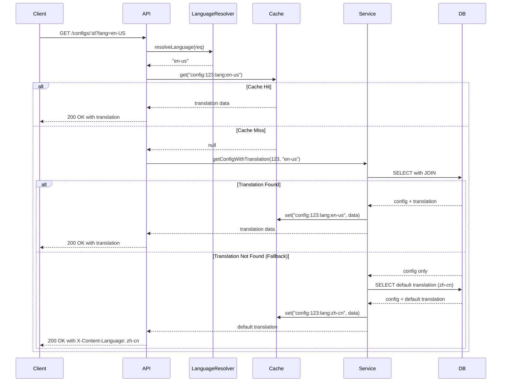

# Design Document: Multilingual Content Support

## Overview

本设计文档描述了域名配置管理服务的多语言内容支持功能的技术实现方案。该功能采用独立翻译表架构，通过 Sequelize ORM 管理多语言数据，使用 Redis 缓存提升性能，并提供完整的 RESTful API 支持多语言内容的 CRUD 操作。

### 核心设计决策

1. **独立翻译表架构**: 使用单独的 `translations` 表存储多语言内容，而不是在 `configs` 表中使用 JSON 字段
   - 优势：更好的查询性能、类型安全、支持数据库索引、便于数据验证
   - 劣势：需要 JOIN 操作，但可通过缓存优化

2. **语言代码标准化**: 采用 BCP 47 标准（如 zh-CN, en-US, ja-JP）
   - 统一的语言标识格式
   - 支持区域变体（如 zh-CN vs zh-TW）

3. **默认语言机制**: zh-CN 作为系统默认语言
   - 所有配置必须有 zh-CN 翻译
   - 其他语言可选，不存在时降级到 zh-CN

4. **缓存策略**: 使用 Redis 缓存完整的翻译对象
   - 缓存键格式：`config:{configId}:lang:{languageCode}`
   - TTL: 3600 秒
   - 写入时失效策略

## Architecture

### 系统架构层次

```
┌─────────────────────────────────────────────────────────────┐
│                        API Layer                             │
│  ┌──────────────────┐  ┌──────────────────┐                │
│  │ Config Routes    │  │ Translation      │                │
│  │ (existing)       │  │ Routes (new)     │                │
│  └──────────────────┘  └──────────────────┘                │
└─────────────────────────────────────────────────────────────┘
                            │
┌─────────────────────────────────────────────────────────────┐
│                     Service Layer                            │
│  ┌──────────────────┐  ┌──────────────────┐                │
│  │ Config Service   │  │ Translation      │                │
│  │ (enhanced)       │  │ Service (new)    │                │
│  └──────────────────┘  └──────────────────┘                │
│           │                      │                           │
│           └──────────┬───────────┘                           │
│                      │                                       │
│           ┌──────────▼──────────┐                           │
│           │ Language Resolver   │                           │
│           │ (new)               │                           │
│           └─────────────────────┘                           │
└─────────────────────────────────────────────────────────────┘
                            │
┌─────────────────────────────────────────────────────────────┐
│                      Cache Layer                             │
│  ┌──────────────────────────────────────────────────────┐  │
│  │              Redis Cache Manager                      │  │
│  │  - Translation caching                                │  │
│  │  - Cache invalidation                                 │  │
│  └──────────────────────────────────────────────────────┘  │
└─────────────────────────────────────────────────────────────┘
                            │
┌─────────────────────────────────────────────────────────────┐
│                   Data Access Layer                          │
│  ┌──────────────────┐  ┌──────────────────┐                │
│  │ Config Model     │  │ Translation      │                │
│  │ (existing)       │  │ Model (new)      │                │
│  └──────────────────┘  └──────────────────┘                │
└─────────────────────────────────────────────────────────────┘
                            │
┌─────────────────────────────────────────────────────────────┐
│                      Database Layer                          │
│  ┌──────────────────┐  ┌──────────────────┐                │
│  │ configs table    │  │ translations     │                │
│  │                  │  │ table            │                │
│  └──────────────────┘  └──────────────────┘                │
└─────────────────────────────────────────────────────────────┘
```

### 请求处理流程



## Components and Interfaces

### 1. Translation Model (Sequelize)

```typescript
interface TranslationAttributes {
  id: number;
  configId: number;
  languageCode: string;
  title: string;
  author: string;
  description: string;
  keywords: string; // JSON array stored as string
  createdAt: Date;
  updatedAt: Date;
}

class Translation extends Model<TranslationAttributes> {
  public id!: number;
  public configId!: number;
  public languageCode!: string;
  public title!: string;
  public author!: string;
  public description!: string;
  public keywords!: string;
  public readonly createdAt!: Date;
  public readonly updatedAt!: Date;
}

// Model definition
Translation.init({
  id: {
    type: DataTypes.INTEGER,
    autoIncrement: true,
    primaryKey: true
  },
  configId: {
    type: DataTypes.INTEGER,
    allowNull: false,
    field: 'config_id',
    references: {
      model: 'configs',
      key: 'id'
    },
    onDelete: 'CASCADE'
  },
  languageCode: {
    type: DataTypes.STRING(10),
    allowNull: false,
    field: 'language_code'
  },
  title: {
    type: DataTypes.STRING(200),
    allowNull: false
  },
  author: {
    type: DataTypes.STRING(100),
    allowNull: false
  },
  description: {
    type: DataTypes.STRING(1000),
    allowNull: false
  },
  keywords: {
    type: DataTypes.TEXT,
    allowNull: false,
    get() {
      const raw = this.getDataValue('keywords');
      return raw ? JSON.parse(raw) : [];
    },
    set(value: string[]) {
      this.setDataValue('keywords', JSON.stringify(value));
    }
  }
}, {
  sequelize,
  tableName: 'translations',
  indexes: [
    {
      unique: true,
      fields: ['config_id', 'language_code']
    },
    {
      fields: ['language_code']
    }
  ]
});
```

### 2. Language Resolver Service

```typescript
interface LanguageResolverConfig {
  defaultLanguage: string;
  supportedLanguages: string[];
}

class LanguageResolver {
  private defaultLanguage: string;
  private supportedLanguages: Set<string>;

  constructor(config: LanguageResolverConfig) {
    this.defaultLanguage = config.defaultLanguage;
    this.supportedLanguages = new Set(config.supportedLanguages);
  }

  /**
   * Resolve language from request
   * Priority: query param > Accept-Language header > default
   */
  resolveLanguage(req: Request): string {
    // Check query parameter
    if (req.query.lang && typeof req.query.lang === 'string') {
      return this.normalizeLanguageCode(req.query.lang);
    }

    // Check Accept-Language header
    const acceptLanguage = req.headers['accept-language'];
    if (acceptLanguage) {
      const parsed = this.parseAcceptLanguage(acceptLanguage);
      if (parsed) {
        return this.normalizeLanguageCode(parsed);
      }
    }

    return this.defaultLanguage;
  }

  /**
   * Normalize language code to lowercase with hyphen
   */
  normalizeLanguageCode(code: string): string {
    return code.toLowerCase().replace('_', '-');
  }

  /**
   * Parse Accept-Language header and return best match
   */
  parseAcceptLanguage(header: string): string | null {
    const languages = header.split(',').map(lang => {
      const parts = lang.trim().split(';');
      const code = parts[0];
      const qMatch = parts[1]?.match(/q=([\d.]+)/);
      const quality = qMatch ? parseFloat(qMatch[1]) : 1.0;
      return { code, quality };
    });

    languages.sort((a, b) => b.quality - a.quality);

    for (const lang of languages) {
      const normalized = this.normalizeLanguageCode(lang.code);
      if (this.supportedLanguages.has(normalized)) {
        return normalized;
      }
    }

    return null;
  }

  /**
   * Validate if language code is supported
   */
  isSupported(languageCode: string): boolean {
    return this.supportedLanguages.has(this.normalizeLanguageCode(languageCode));
  }

  getDefaultLanguage(): string {
    return this.defaultLanguage;
  }

  getSupportedLanguages(): string[] {
    return Array.from(this.supportedLanguages);
  }
}
```

### 3. Translation Service

```typescript
interface CreateTranslationDTO {
  configId: number;
  languageCode: string;
  title: string;
  author: string;
  description: string;
  keywords: string[];
}

interface UpdateTranslationDTO {
  title?: string;
  author?: string;
  description?: string;
  keywords?: string[];
}

interface TranslationResponse {
  id: number;
  configId: number;
  languageCode: string;
  title: string;
  author: string;
  description: string;
  keywords: string[];
  createdAt: Date;
  updatedAt: Date;
}

class TranslationService {
  constructor(
    private translationModel: typeof Translation,
    private cacheManager: CacheManager,
    private languageResolver: LanguageResolver
  ) {}

  async createTranslation(data: CreateTranslationDTO): Promise<TranslationResponse> {
    // Validate language code
    const normalizedLang = this.languageResolver.normalizeLanguageCode(data.languageCode);
    if (!this.languageResolver.isSupported(normalizedLang)) {
      throw new ValidationError(`Unsupported language: ${data.languageCode}`);
    }

    // Check for duplicate
    const existing = await this.translationModel.findOne({
      where: {
        configId: data.configId,
        languageCode: normalizedLang
      }
    });

    if (existing) {
      throw new ConflictError(`Translation already exists for config ${data.configId} and language ${normalizedLang}`);
    }

    // Create translation
    const translation = await this.translationModel.create({
      ...data,
      languageCode: normalizedLang
    });

    // Invalidate cache
    await this.invalidateCache(data.configId, normalizedLang);

    return this.toResponse(translation);
  }

  async updateTranslation(
    configId: number,
    languageCode: string,
    data: UpdateTranslationDTO
  ): Promise<TranslationResponse> {
    const normalizedLang = this.languageResolver.normalizeLanguageCode(languageCode);

    const translation = await this.translationModel.findOne({
      where: { configId, languageCode: normalizedLang }
    });

    if (!translation) {
      throw new NotFoundError(`Translation not found for config ${configId} and language ${normalizedLang}`);
    }

    await translation.update(data);

    // Invalidate cache
    await this.invalidateCache(configId, normalizedLang);

    return this.toResponse(translation);
  }

  async getTranslation(configId: number, languageCode: string): Promise<TranslationResponse | null> {
    const normalizedLang = this.languageResolver.normalizeLanguageCode(languageCode);

    // Try cache first
    const cacheKey = this.getCacheKey(configId, normalizedLang);
    const cached = await this.cacheManager.get<TranslationResponse>(cacheKey);
    if (cached) {
      return cached;
    }

    // Query database
    const translation = await this.translationModel.findOne({
      where: { configId, languageCode: normalizedLang }
    });

    if (!translation) {
      return null;
    }

    const response = this.toResponse(translation);

    // Cache the result
    await this.cacheManager.set(cacheKey, response, 3600);

    return response;
  }

  async getTranslationWithFallback(
    configId: number,
    languageCode: string
  ): Promise<{ translation: TranslationResponse; actualLanguage: string }> {
    const normalizedLang = this.languageResolver.normalizeLanguageCode(languageCode);

    // Try requested language
    let translation = await this.getTranslation(configId, normalizedLang);
    if (translation) {
      return { translation, actualLanguage: normalizedLang };
    }

    // Fallback to default language
    const defaultLang = this.languageResolver.getDefaultLanguage();
    translation = await this.getTranslation(configId, defaultLang);

    if (!translation) {
      throw new NotFoundError(`No translation found for config ${configId}`);
    }

    return { translation, actualLanguage: defaultLang };
  }

  async getAllTranslations(configId: number): Promise<TranslationResponse[]> {
    const translations = await this.translationModel.findAll({
      where: { configId }
    });

    return translations.map(t => this.toResponse(t));
  }

  async deleteTranslation(configId: number, languageCode: string): Promise<void> {
    const normalizedLang = this.languageResolver.normalizeLanguageCode(languageCode);

    // Prevent deletion of default language if other translations exist
    if (normalizedLang === this.languageResolver.getDefaultLanguage()) {
      const count = await this.translationModel.count({
        where: { configId }
      });

      if (count > 1) {
        throw new ValidationError('Cannot delete default language translation while other translations exist');
      }
    }

    const deleted = await this.translationModel.destroy({
      where: { configId, languageCode: normalizedLang }
    });

    if (deleted === 0) {
      throw new NotFoundError(`Translation not found for config ${configId} and language ${normalizedLang}`);
    }

    // Invalidate cache
    await this.invalidateCache(configId, normalizedLang);
  }

  private getCacheKey(configId: number, languageCode: string): string {
    return `config:${configId}:lang:${languageCode}`;
  }

  private async invalidateCache(configId: number, languageCode: string): Promise<void> {
    const cacheKey = this.getCacheKey(configId, languageCode);
    await this.cacheManager.delete(cacheKey);
  }

  private toResponse(translation: Translation): TranslationResponse {
    return {
      id: translation.id,
      configId: translation.configId,
      languageCode: translation.languageCode,
      title: translation.title,
      author: translation.author,
      description: translation.description,
      keywords: translation.keywords as any,
      createdAt: translation.createdAt,
      updatedAt: translation.updatedAt
    };
  }
}
```


### 4. Enhanced Config Service

```typescript
interface ConfigWithTranslation {
  id: number;
  // Non-translatable fields from configs table
  links: any;
  permissions: any;
  createdAt: Date;
  updatedAt: Date;
  // Translatable fields from translations table
  title: string;
  author: string;
  description: string;
  keywords: string[];
  // Metadata
  language: string;
}

class ConfigService {
  constructor(
    private configModel: typeof Config,
    private translationService: TranslationService,
    private languageResolver: LanguageResolver
  ) {}

  async getConfigById(id: number, languageCode?: string): Promise<ConfigWithTranslation> {
    // Get base config
    const config = await this.configModel.findByPk(id);
    if (!config) {
      throw new NotFoundError(`Config not found: ${id}`);
    }

    // Determine language
    const lang = languageCode || this.languageResolver.getDefaultLanguage();

    // Get translation with fallback
    const { translation, actualLanguage } = await this.translationService.getTranslationWithFallback(id, lang);

    return this.mergeConfigWithTranslation(config, translation, actualLanguage);
  }

  async getConfigByDomain(domain: string, languageCode?: string): Promise<ConfigWithTranslation> {
    // Get domain-config mapping
    const domainRecord = await this.domainModel.findOne({
      where: { domain }
    });

    if (!domainRecord) {
      throw new NotFoundError(`Domain not found: ${domain}`);
    }

    return this.getConfigById(domainRecord.configId, languageCode);
  }

  async listConfigs(languageCode?: string): Promise<ConfigWithTranslation[]> {
    const configs = await this.configModel.findAll();
    const lang = languageCode || this.languageResolver.getDefaultLanguage();

    const results = await Promise.all(
      configs.map(async config => {
        const { translation, actualLanguage } = await this.translationService.getTranslationWithFallback(
          config.id,
          lang
        );
        return this.mergeConfigWithTranslation(config, translation, actualLanguage);
      })
    );

    return results;
  }

  private mergeConfigWithTranslation(
    config: Config,
    translation: TranslationResponse,
    language: string
  ): ConfigWithTranslation {
    return {
      id: config.id,
      links: config.links,
      permissions: config.permissions,
      createdAt: config.createdAt,
      updatedAt: config.updatedAt,
      title: translation.title,
      author: translation.author,
      description: translation.description,
      keywords: translation.keywords,
      language
    };
  }
}
```

### 5. Cache Manager

```typescript
interface CacheManager {
  get<T>(key: string): Promise<T | null>;
  set(key: string, value: any, ttl: number): Promise<void>;
  delete(key: string): Promise<void>;
  deletePattern(pattern: string): Promise<void>;
}

class RedisCacheManager implements CacheManager {
  constructor(private redisClient: Redis) {}

  async get<T>(key: string): Promise<T | null> {
    const value = await this.redisClient.get(key);
    if (!value) {
      return null;
    }
    return JSON.parse(value) as T;
  }

  async set(key: string, value: any, ttl: number): Promise<void> {
    await this.redisClient.setex(key, ttl, JSON.stringify(value));
  }

  async delete(key: string): Promise<void> {
    await this.redisClient.del(key);
  }

  async deletePattern(pattern: string): Promise<void> {
    const keys = await this.redisClient.keys(pattern);
    if (keys.length > 0) {
      await this.redisClient.del(...keys);
    }
  }
}
```

## Data Models

### Database Schema

#### translations 表

```sql
CREATE TABLE translations (
  id INT AUTO_INCREMENT PRIMARY KEY,
  config_id INT NOT NULL,
  language_code VARCHAR(10) NOT NULL,
  title VARCHAR(200) NOT NULL,
  author VARCHAR(100) NOT NULL,
  description VARCHAR(1000) NOT NULL,
  keywords TEXT NOT NULL,
  created_at TIMESTAMP DEFAULT CURRENT_TIMESTAMP,
  updated_at TIMESTAMP DEFAULT CURRENT_TIMESTAMP ON UPDATE CURRENT_TIMESTAMP,
  
  UNIQUE KEY unique_config_language (config_id, language_code),
  KEY idx_language_code (language_code),
  
  CONSTRAINT fk_translation_config 
    FOREIGN KEY (config_id) 
    REFERENCES configs(id) 
    ON DELETE CASCADE
) ENGINE=InnoDB DEFAULT CHARSET=utf8mb4 COLLATE=utf8mb4_unicode_ci;
```

#### configs 表（现有，保持不变）

```sql
CREATE TABLE configs (
  id INT AUTO_INCREMENT PRIMARY KEY,
  links JSON,
  permissions JSON,
  created_at TIMESTAMP DEFAULT CURRENT_TIMESTAMP,
  updated_at TIMESTAMP DEFAULT CURRENT_TIMESTAMP ON UPDATE CURRENT_TIMESTAMP
) ENGINE=InnoDB DEFAULT CHARSET=utf8mb4 COLLATE=utf8mb4_unicode_ci;
```

#### domains 表（现有，保持不变）

```sql
CREATE TABLE domains (
  id INT AUTO_INCREMENT PRIMARY KEY,
  domain VARCHAR(255) NOT NULL UNIQUE,
  config_id INT NOT NULL,
  created_at TIMESTAMP DEFAULT CURRENT_TIMESTAMP,
  updated_at TIMESTAMP DEFAULT CURRENT_TIMESTAMP ON UPDATE CURRENT_TIMESTAMP,
  
  CONSTRAINT fk_domain_config 
    FOREIGN KEY (config_id) 
    REFERENCES configs(id) 
    ON DELETE CASCADE
) ENGINE=InnoDB DEFAULT CHARSET=utf8mb4 COLLATE=utf8mb4_unicode_ci;
```

### Entity Relationships

```
┌─────────────────┐
│    domains      │
│─────────────────│
│ id (PK)         │
│ domain          │
│ config_id (FK)  │───┐
└─────────────────┘   │
                      │
                      │ 1:N
                      │
                      ▼
                ┌─────────────────┐
                │    configs      │
                │─────────────────│
                │ id (PK)         │
                │ links           │
                │ permissions     │
                └─────────────────┘
                      │
                      │ 1:N
                      │
                      ▼
                ┌─────────────────┐
                │  translations   │
                │─────────────────│
                │ id (PK)         │
                │ config_id (FK)  │
                │ language_code   │
                │ title           │
                │ author          │
                │ description     │
                │ keywords        │
                └─────────────────┘
```

### Data Migration Strategy

迁移现有数据到新架构：

```typescript
async function migrateExistingConfigs() {
  const configs = await Config.findAll();
  const defaultLanguage = 'zh-cn';

  for (const config of configs) {
    // Create default language translation from existing data
    await Translation.create({
      configId: config.id,
      languageCode: defaultLanguage,
      title: config.title || 'Untitled',
      author: config.author || 'Unknown',
      description: config.description || '',
      keywords: config.keywords || []
    });
  }

  // After migration, remove translatable fields from configs table
  // This would be done via a separate migration
}
```

## API Design

### Translation Management Endpoints

#### 1. Create Translation

```
POST /api/configs/:configId/translations
Content-Type: application/json

Request Body:
{
  "languageCode": "en-us",
  "title": "Example Title",
  "author": "John Doe",
  "description": "This is an example description",
  "keywords": ["example", "test", "demo"]
}

Response: 201 Created
{
  "id": 123,
  "configId": 456,
  "languageCode": "en-us",
  "title": "Example Title",
  "author": "John Doe",
  "description": "This is an example description",
  "keywords": ["example", "test", "demo"],
  "createdAt": "2024-01-15T10:30:00Z",
  "updatedAt": "2024-01-15T10:30:00Z"
}

Error Responses:
- 400 Bad Request: Invalid language code or validation error
- 404 Not Found: Config not found
- 409 Conflict: Translation already exists for this language
```

#### 2. Update Translation

```
PUT /api/configs/:configId/translations/:languageCode
Content-Type: application/json

Request Body:
{
  "title": "Updated Title",
  "description": "Updated description"
}

Response: 200 OK
{
  "id": 123,
  "configId": 456,
  "languageCode": "en-us",
  "title": "Updated Title",
  "author": "John Doe",
  "description": "Updated description",
  "keywords": ["example", "test", "demo"],
  "createdAt": "2024-01-15T10:30:00Z",
  "updatedAt": "2024-01-15T11:45:00Z"
}

Error Responses:
- 400 Bad Request: Validation error
- 404 Not Found: Translation not found
```

#### 3. Get All Translations for Config

```
GET /api/configs/:configId/translations

Response: 200 OK
[
  {
    "id": 123,
    "configId": 456,
    "languageCode": "zh-cn",
    "title": "示例标题",
    "author": "张三",
    "description": "这是一个示例描述",
    "keywords": ["示例", "测试"],
    "createdAt": "2024-01-15T10:00:00Z",
    "updatedAt": "2024-01-15T10:00:00Z"
  },
  {
    "id": 124,
    "configId": 456,
    "languageCode": "en-us",
    "title": "Example Title",
    "author": "John Doe",
    "description": "This is an example description",
    "keywords": ["example", "test"],
    "createdAt": "2024-01-15T10:30:00Z",
    "updatedAt": "2024-01-15T10:30:00Z"
  }
]

Error Responses:
- 404 Not Found: Config not found
```

#### 4. Delete Translation

```
DELETE /api/configs/:configId/translations/:languageCode

Response: 204 No Content

Error Responses:
- 400 Bad Request: Cannot delete default language while other translations exist
- 404 Not Found: Translation not found
```

### Enhanced Config Query Endpoints

#### 1. Get Config by ID (with language support)

```
GET /api/configs/:id?lang=en-us
Accept-Language: en-US,zh-CN;q=0.9

Response: 200 OK
X-Content-Language: en-us

{
  "id": 456,
  "title": "Example Title",
  "author": "John Doe",
  "description": "This is an example description",
  "keywords": ["example", "test"],
  "links": { ... },
  "permissions": { ... },
  "language": "en-us",
  "createdAt": "2024-01-15T10:00:00Z",
  "updatedAt": "2024-01-15T10:30:00Z"
}

Note: If requested language not available, returns default language with:
X-Content-Language: zh-cn
```

#### 2. Get Config by Domain (with language support)

```
GET /api/domains/:domain/config?lang=ja-jp

Response: 200 OK
X-Content-Language: ja-jp

{
  "id": 456,
  "title": "例のタイトル",
  "author": "田中太郎",
  "description": "これは例の説明です",
  "keywords": ["例", "テスト"],
  "links": { ... },
  "permissions": { ... },
  "language": "ja-jp",
  "createdAt": "2024-01-15T10:00:00Z",
  "updatedAt": "2024-01-15T10:30:00Z"
}
```

#### 3. List Configs (with language support)

```
GET /api/configs?lang=en-us

Response: 200 OK
[
  {
    "id": 456,
    "title": "Example Title",
    "author": "John Doe",
    "description": "This is an example description",
    "keywords": ["example", "test"],
    "links": { ... },
    "permissions": { ... },
    "language": "en-us",
    "createdAt": "2024-01-15T10:00:00Z",
    "updatedAt": "2024-01-15T10:30:00Z"
  },
  ...
]
```

### Language Metadata Endpoint

```
GET /api/languages

Response: 200 OK
{
  "default": "zh-cn",
  "supported": [
    {
      "code": "zh-cn",
      "name": "中文（简体）",
      "englishName": "Chinese (Simplified)"
    },
    {
      "code": "en-us",
      "name": "English (US)",
      "englishName": "English (US)"
    },
    {
      "code": "ja-jp",
      "name": "日本語",
      "englishName": "Japanese"
    }
  ]
}
```

## Error Handling

### Error Response Format

```typescript
interface ErrorResponse {
  error: {
    code: string;
    message: string;
    details?: any;
  };
}
```

### Error Types

1. **ValidationError (400)**
   - Invalid language code
   - Missing required fields
   - Field length exceeds limit
   - Invalid JSON format for keywords

2. **NotFoundError (404)**
   - Config not found
   - Translation not found
   - Domain not found

3. **ConflictError (409)**
   - Translation already exists for language
   - Duplicate unique constraint violation

4. **InternalServerError (500)**
   - Database connection error
   - Redis connection error
   - Unexpected errors

### Error Handling Examples

```typescript
// Validation error
{
  "error": {
    "code": "VALIDATION_ERROR",
    "message": "Unsupported language code",
    "details": {
      "languageCode": "xx-XX",
      "supported": ["zh-cn", "en-us", "ja-jp"]
    }
  }
}

// Not found error
{
  "error": {
    "code": "NOT_FOUND",
    "message": "Translation not found for config 456 and language en-us"
  }
}

// Conflict error
{
  "error": {
    "code": "CONFLICT",
    "message": "Translation already exists for config 456 and language en-us"
  }
}

// Cannot delete default language
{
  "error": {
    "code": "VALIDATION_ERROR",
    "message": "Cannot delete default language translation while other translations exist",
    "details": {
      "languageCode": "zh-cn",
      "translationCount": 3
    }
  }
}
```

## Testing Strategy

本功能采用双重测试策略：单元测试验证具体示例和边界情况，属性测试验证通用正确性属性。

### Unit Testing

单元测试关注：
- 具体的业务逻辑示例
- 边界条件和错误处理
- 组件集成点
- API 端点行为

测试框架：Jest + Supertest

### Property-Based Testing

属性测试关注：
- 跨所有输入的通用属性
- 数据一致性保证
- 缓存正确性
- 语言降级行为

测试框架：fast-check (JavaScript/TypeScript 的属性测试库)

配置要求：
- 每个属性测试最少 100 次迭代
- 每个测试必须标注对应的设计属性
- 标签格式：`Feature: multilingual-content-support, Property {number}: {property_text}`

### Test Coverage Requirements

- 代码覆盖率目标：80% 以上
- 关键路径必须有属性测试覆盖
- 所有 API 端点必须有集成测试
- 错误处理路径必须有单元测试


## Correctness Properties

*属性（Property）是一个特征或行为，应该在系统的所有有效执行中保持为真——本质上是关于系统应该做什么的形式化陈述。属性作为人类可读规范和机器可验证正确性保证之间的桥梁。*

### Property 1: Translation Storage Integrity

*For any* valid translation data (config ID, language code, title, author, description, keywords), when a translation is created, it should be stored in the database with all fields intact and retrievable with the same values.

**Validates: Requirements 1.1, 1.3**

### Property 2: Language Code Validation and Normalization

*For any* language code input, the system should accept only valid BCP 47 format codes (e.g., zh-CN, en-US, ja-JP), normalize them to lowercase with hyphen format (zh-cn, en-us, ja-jp), and reject invalid codes with a 400 error.

**Validates: Requirements 1.2, 2.5, 8.1, 9.3**

### Property 3: Multiple Translations Per Config

*For any* config and any set of different language codes, the system should allow creating multiple translations for the same config, and all translations should be independently stored and retrievable.

**Validates: Requirements 1.4**

### Property 4: Referential Integrity and Cascade Deletion

*For any* config with associated translations, when the config is deleted, all associated translations should be automatically deleted (cascade), and attempting to create a translation for a non-existent config should fail.

**Validates: Requirements 1.5, 4.6, 10.3**

### Property 5: Accept-Language Header Parsing

*For any* valid Accept-Language header (including quality values and multiple languages), the system should correctly parse it and extract the highest-priority supported language code.

**Validates: Requirements 2.1**

### Property 6: Language Request Priority

*For any* request with both Accept-Language header and language query parameter, the query parameter should always take precedence over the header value.

**Validates: Requirements 2.3**

### Property 7: Invalid Language Code Error Handling

*For any* invalid or malformed language code in a request, the system should return a 400 Bad Request error with a descriptive message.

**Validates: Requirements 2.4**

### Property 8: Language Fallback Mechanism

*For any* config and any unsupported or non-existent language code, when requesting a translation, the system should return the default language (zh-cn) translation and include an X-Content-Language header indicating the actual language returned.

**Validates: Requirements 3.1, 3.4**

### Property 9: Fallback Logging

*For any* language fallback event (when requested language is unavailable), the system should log the event with config ID, requested language, and returned language.

**Validates: Requirements 3.5**

### Property 10: Required Fields Validation

*For any* translation creation or update request, if any required translatable field (title, author, description, keywords) is missing or empty, the system should reject the request with a 400 validation error.

**Validates: Requirements 4.5, 8.2**

### Property 11: Default Language Protection

*For any* config with multiple translations, attempting to delete the default language (zh-cn) translation should fail with a validation error, but deleting non-default language translations should succeed.

**Validates: Requirements 4.7**

### Property 12: Language-Specific Query Results

*For any* config query (by ID, by domain, or list) with a specified language code, all returned configs should contain translations in the requested language (or default language if unavailable), and the language field should correctly indicate which language was returned.

**Validates: Requirements 5.1, 5.2, 5.3**

### Property 13: Data Merging Correctness

*For any* config with translations, when querying the config, the returned object should contain all non-translatable fields (links, permissions) from the configs table merged with translatable fields (title, author, description, keywords) from the translations table.

**Validates: Requirements 5.4**

### Property 14: Default Language When Unspecified

*For any* config query without a language code specified, the system should return the default language (zh-cn) translation.

**Validates: Requirements 5.5, 7.1**

### Property 15: Cache Storage and Retrieval

*For any* translation retrieved from the database, it should be cached in Redis with the key format "config:{configId}:lang:{languageCode}", and subsequent requests for the same translation should be served from cache without database access.

**Validates: Requirements 6.1, 6.2, 6.6**

### Property 16: Cache Invalidation on Update

*For any* translation, when it is updated or deleted, the corresponding cache entry should be immediately invalidated, and the next request should fetch fresh data from the database.

**Validates: Requirements 6.3**

### Property 17: Batch Cache Invalidation

*For any* config with multiple cached translations in different languages, when the config is deleted, all cache entries for all languages should be invalidated.

**Validates: Requirements 6.4**

### Property 18: Cache TTL Configuration

*For any* translation cached in Redis, the TTL should be set to exactly 3600 seconds.

**Validates: Requirements 6.5**

### Property 19: Duplicate Translation Prevention

*For any* config and language code combination, attempting to create a second translation with the same config ID and language code should fail with a 409 Conflict error.

**Validates: Requirements 8.3**

### Property 20: Database Constraint Error Handling

*For any* database constraint violation (foreign key, unique constraint, etc.), the system should catch the error and return a descriptive error response rather than exposing raw database errors.

**Validates: Requirements 8.4**

### Property 21: Field Length Validation

*For any* translation, the title should not exceed 200 characters and the description should not exceed 1000 characters; violations should result in a 400 validation error.

**Validates: Requirements 8.5, 8.6**

### Property 22: Keywords Format Validation

*For any* translation, the keywords field should be a valid JSON array of strings; invalid formats should result in a 400 validation error.

**Validates: Requirements 8.7**

### Property 23: Translation Round-Trip Consistency

*For any* valid translation, creating it via the API and then retrieving it should return an equivalent translation with all fields matching the original input (excluding auto-generated fields like id, createdAt, updatedAt).

**Validates: Requirements 1.1, 4.1, 5.1**

### Property 24: Query Parameter Language Resolution

*For any* request with a language query parameter, the system should use that parameter value as the requested language, regardless of other language indicators.

**Validates: Requirements 2.2**
