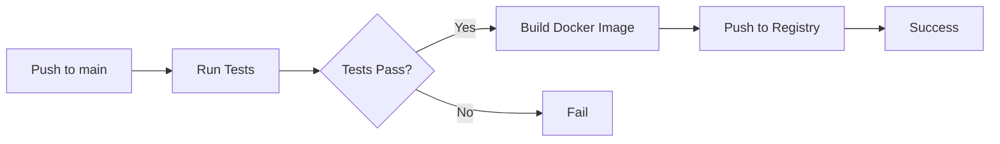

# CI Docker 发布配置指南

## 📦 Docker 镜像发布

项目配置为在 `main` 分支推送时自动构建并发布 Docker 镜像到腾讯云容器镜像服务。

### 镜像地址
```
hkccr.ccs.tencentyun.com/gdgeek/domain
```

### 镜像标签策略
- `latest` - 最新的 main 分支构建
- `main-<sha>` - 特定提交的构建（如 `main-758b3cb`）
- `main` - main 分支的最新构建

---

## 🔐 配置 GitHub Secrets

在 GitHub 仓库中配置以下 Secrets：

### 1. 进入仓库设置
```
GitHub 仓库 → Settings → Secrets and variables → Actions
```

### 2. 添加以下 Secrets

#### TENCENT_REGISTRY_USERNAME
- **名称**: `TENCENT_REGISTRY_USERNAME`
- **值**: 腾讯云容器镜像服务的用户名
- **获取方式**: 
  1. 登录腾讯云控制台
  2. 进入容器镜像服务
  3. 访问令牌管理
  4. 查看或创建访问令牌

#### TENCENT_REGISTRY_PASSWORD
- **名称**: `TENCENT_REGISTRY_PASSWORD`
- **值**: 腾讯云容器镜像服务的密码/令牌
- **获取方式**: 
  1. 登录腾讯云控制台
  2. 进入容器镜像服务
  3. 访问令牌管理
  4. 查看或创建访问令牌

---

## 🚀 触发构建

### 自动触发
当代码推送到 `main` 分支时，CI 会自动：
1. 运行所有测试
2. 构建 Docker 镜像
3. 推送到腾讯云容器镜像服务

### 手动触发
也可以通过 GitHub Actions 页面手动触发工作流。

---

## 📋 CI 工作流程



### 详细步骤

1. **测试阶段** (test job)
   - 安装依赖
   - 运行 ESLint
   - 运行类型检查
   - 运行单元测试
   - 生成覆盖率报告

2. **构建阶段** (build job)
   - 编译 TypeScript
   - 上传构建产物

3. **Docker 阶段** (docker job)
   - 仅在 main 分支推送时执行
   - 登录腾讯云容器镜像服务
   - 构建 Docker 镜像
   - 推送到镜像仓库
   - 生成多个标签

---

## 🐳 使用发布的镜像

### 拉取镜像
```bash
# 拉取最新版本
docker pull hkccr.ccs.tencentyun.com/gdgeek/domain:latest

# 拉取特定版本
docker pull hkccr.ccs.tencentyun.com/gdgeek/domain:main-758b3cb
```

### 运行容器
```bash
docker run -d \
  --name domain-config \
  -p 3000:3000 \
  -e DB_HOST=your-db-host \
  -e DB_NAME=your-db-name \
  -e DB_USER=your-db-user \
  -e DB_PASSWORD=your-db-password \
  hkccr.ccs.tencentyun.com/gdgeek/domain:latest
```

### 使用 docker-compose
```yaml
version: '3.8'

services:
  app:
    image: hkccr.ccs.tencentyun.com/gdgeek/domain:latest
    ports:
      - "3000:3000"
    environment:
      - DB_HOST=mysql
      - DB_NAME=domain_config
      - DB_USER=root
      - DB_PASSWORD=password
    depends_on:
      - mysql

  mysql:
    image: mysql:8.0
    environment:
      - MYSQL_ROOT_PASSWORD=password
      - MYSQL_DATABASE=domain_config
```

---

## 🔍 查看构建状态

### GitHub Actions
访问仓库的 Actions 标签查看构建状态：
```
https://github.com/gdgeek/domain-config-hub/actions
```

### 构建徽章
可以在 README.md 中添加构建状态徽章：
```markdown

```

---

## 🛠️ 故障排查

### 构建失败
1. 检查测试是否通过
2. 检查 Docker 构建日志
3. 验证 Secrets 配置是否正确

### 推送失败
1. 验证腾讯云容器镜像服务凭据
2. 检查镜像仓库是否存在
3. 确认网络连接正常

### 镜像拉取失败
1. 确认镜像已成功推送
2. 检查镜像标签是否正确
3. 验证拉取凭据（如果是私有仓库）

---

## 📚 相关文档

- [GitHub Actions 文档](https://docs.github.com/en/actions)
- [Docker Build Push Action](https://github.com/docker/build-push-action)
- [腾讯云容器镜像服务](https://cloud.tencent.com/document/product/1141)

---

## 🔄 更新记录

- 2026-01-25: 初始配置，支持推送到腾讯云容器镜像服务
