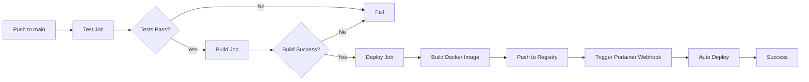

-# CI Docker 发布配置指南

## 📦 Docker 镜像发布

项目配置为在 `main` 分支推送时自动构建并发布 Docker 镜像到腾讯云容器镜像服务。

### 镜像地址
```
hkccr.ccs.tencentyun.com/gdgeek/domain
```

### 镜像标签策略
- `latest` - 最新的 main 分支构建
- `main-<sha>` - 特定提交的构建（如 `main-758b3cb`）
- `main` - main 分支的最新构建

---

## 🔐 配置 GitHub Secrets

在 GitHub 仓库中配置以下 Secrets：

### 1. 进入仓库设置
```
GitHub 仓库 → Settings → Secrets and variables → Actions
```

### 2. 添加以下 Secrets

#### TENCENT_DOCKER_USERNAME
- **名称**: `TENCENT_DOCKER_USERNAME`
- **值**: 腾讯云容器镜像服务的用户名
- **获取方式**: 
  1. 登录腾讯云控制台
  2. 进入容器镜像服务
  3. 访问令牌管理
  4. 查看或创建访问令牌

#### TENCENT_DOCKER_PASSWORD
- **名称**: `TENCENT_DOCKER_PASSWORD`
- **值**: 腾讯云容器镜像服务的密码/令牌
- **获取方式**: 
  1. 登录腾讯云控制台
  2. 进入容器镜像服务
  3. 访问令牌管理
  4. 查看或创建访问令牌

#### PORTAINER_WEBHOOK_URL
- **名称**: `PORTAINER_WEBHOOK_URL`
- **值**: Portainer Webhook URL
- **获取方式**: 
  1. 登录 Portainer
  2. 进入 Stacks 或 Services
  3. 找到对应的服务
  4. 创建或查看 Webhook URL
- **格式**: `https://your-portainer-domain/api/webhooks/xxxxxxxx-xxxx-xxxx-xxxx-xxxxxxxxxxxx`
- **说明**: 镜像推送成功后会自动触发此 Webhook，用于自动部署更新

---

## 🚀 触发构建

### 自动触发
当代码推送到 `main` 分支时，CI 会自动执行三个阶段：

1. **Test**：运行所有测试和代码检查
2. **Build**：编译 TypeScript 代码
3. **Deploy**：构建并推送 Docker 镜像，触发自动部署

只有前面的阶段成功，才会执行下一个阶段。Deploy 阶段仅在 main 分支推送时执行。

### 手动触发
也可以通过 GitHub Actions 页面手动触发工作流。

---

## 📋 CI 工作流程

CI 流程分为三个独立的阶段：Test → Build → Deploy



### 详细步骤

#### 1. Test Job（测试阶段）
- 安装依赖
- 运行 ESLint 代码检查
- 运行 TypeScript 类型检查
- 运行单元测试和集成测试
- 生成代码覆盖率报告
- 上传覆盖率到 Codecov

**触发条件**：所有分支的 push 和 pull request

#### 2. Build Job（构建阶段）
- 编译 TypeScript 代码
- 生成生产环境构建产物
- 上传构建产物为 artifacts

**触发条件**：Test Job 成功后执行

#### 3. Deploy Job（部署阶段）
- 登录腾讯云容器镜像服务
- 构建 Docker 镜像
- 推送镜像到镜像仓库
- 生成多个标签（latest、main、main-sha）
- 触发 Portainer Webhook 自动部署

**触发条件**：
- Test Job 和 Build Job 都成功
- 仅在 main 分支推送时执行
- 不在 pull request 时执行

---

## 🐳 使用发布的镜像

### 拉取镜像
```bash
# 拉取最新版本
docker pull hkccr.ccs.tencentyun.com/gdgeek/domain:latest

# 拉取特定版本
docker pull hkccr.ccs.tencentyun.com/gdgeek/domain:main-758b3cb
```

### 运行容器
```bash
docker run -d \
  --name domain-config \
  -p 3000:3000 \
  -e DB_HOST=your-db-host \
  -e DB_NAME=your-db-name \
  -e DB_USER=your-db-user \
  -e DB_PASSWORD=your-db-password \
  hkccr.ccs.tencentyun.com/gdgeek/domain:latest
```

### 使用 docker-compose
```yaml
version: '3.8'

services:
  app:
    image: hkccr.ccs.tencentyun.com/gdgeek/domain:latest
    ports:
      - "3000:3000"
    environment:
      - DB_HOST=mysql
      - DB_NAME=domain_config
      - DB_USER=root
      - DB_PASSWORD=password
    depends_on:
      - mysql

  mysql:
    image: mysql:8.0
    environment:
      - MYSQL_ROOT_PASSWORD=password
      - MYSQL_DATABASE=domain_config
```

---

## � 自动部署

### Portainer Webhook

镜像推送成功后，CI 会自动触发 Portainer Webhook，实现自动部署。

#### 配置 Portainer Webhook

1. **在 Portainer 中创建 Webhook**
   ```
   Portainer → Stacks/Services → 选择服务 → Webhooks → Add webhook
   ```

2. **复制 Webhook URL**
   ```
   https://your-portainer-domain/api/webhooks/xxxxxxxx-xxxx-xxxx-xxxx-xxxxxxxxxxxx
   ```

3. **添加到 GitHub Secrets**
   - 名称: `PORTAINER_WEBHOOK_URL`
   - 值: 复制的 Webhook URL

#### Webhook 工作流程

1. CI 构建并推送镜像到腾讯云
2. 推送成功后触发 Portainer Webhook
3. Portainer 自动拉取最新镜像
4. Portainer 重启服务使用新镜像
5. 部署完成

#### 手动触发 Webhook

也可以手动触发 Webhook 进行部署：
```bash
curl -X POST https://your-portainer-domain/api/webhooks/xxxxxxxx-xxxx-xxxx-xxxx-xxxxxxxxxxxx
```

---

## 🔍 查看构建状态

### GitHub Actions
访问仓库的 Actions 标签查看构建状态：
```
https://github.com/gdgeek/domain-config-hub/actions
```

### 构建徽章
可以在 README.md 中添加构建状态徽章：
```markdown

```

---

## 🛠️ 故障排查

### 构建失败
1. 检查测试是否通过
2. 检查 Docker 构建日志
3. 验证 Secrets 配置是否正确

### 推送失败
1. 验证腾讯云容器镜像服务凭据
2. 检查镜像仓库是否存在
3. 确认网络连接正常

### 镜像拉取失败
1. 确认镜像已成功推送
2. 检查镜像标签是否正确
3. 验证拉取凭据（如果是私有仓库）

---

## 📚 相关文档

- [GitHub Actions 文档](https://docs.github.com/en/actions)
- [Docker Build Push Action](https://github.com/docker/build-push-action)
- [腾讯云容器镜像服务](https://cloud.tencent.com/document/product/1141)

---

## 🔄 更新记录

- 2026-01-25: 初始配置，支持推送到腾讯云容器镜像服务
- 2026-01-25: 添加 Portainer Webhook 自动部署功能
